Jenkins
=======

Jenkins is an open source continuous integration tool written in Java.

Continuous integration
~~~~~~~~~~~~~~~~~~~~~~

Continuous Integration is a software development practice where members
of a team integrate their work frequently, usually each person integrates
at least daily - leading to multiple integrations per day. Each integration
is verified by an automated build (including test) to detect integration
errors as quickly as possible. Many teams find that this approach leads
to significantly reduced integration problems and allows a team to develop
cohesive software more rapidly.

Our setup
~~~~~~~~~

Our Jenkins instance is running on Ubuntu server in the Amazons AWS cloud.
It can be accessed at http://ci.truh.in/. It automaticly schedules a build
everytime something gets changed on our Github repo.

Besides checking if our sources are buildable, Jenkin will also run our unit
tests, create javadocs, assemble our Sphinx-doc documentation and provide a
fancy badge showing us if the last build failed or succeded.

Nginx
-----

To enable HTTPS and to have Jenkins listen on the default ports (80, 443)
without changing Jenkins configuration, Jenkins runs behind an nginx proxy
server. Here is the nginx configuration, located at ``/etc/nginx/nginx.conf``:

.. code:: conf

    user www-data;
    worker_processes 4;
    pid /run/nginx.pid;

    events {
        worker_connections 768;
    }

    http {
        upstream jenkins {
                server 127.0.0.1:8080 fail_timeout=0;
        }

        server {
            listen 80;
            server_name ci.truh.in;
            location / {
                proxy_pass              http://localhost:8080;
                proxy_set_header        Host $host;
                proxy_set_header        X-Real-IP $remote_addr;
                proxy_set_header        X-Forwarded-For $proxy_add_x_forwarded_for;
                proxy_connect_timeout   150;
                proxy_send_timeout      100;
                proxy_read_timeout      100;
                proxy_buffers           4 32k;
                client_max_body_size    8m;
                client_body_buffer_size 128k;
            }
        }       

        server {
            listen 443 ssl;
            server_name ci.truh.in;

            ssl_certificate /etc/nginx/certificate/jenkins-aws.crt;
            ssl_certificate_key /etc/nginx/certificate/jenkins-aws.key;

            location / {
                proxy_set_header        Host $host;
                proxy_set_header        X-Real-IP $remote_addr;
                proxy_set_header        X-Forwarded-For $proxy_add_x_forwarded_for;
                proxy_set_header        X-Forwarded-Proto $scheme;
                proxy_redirect          http:// https://;
                proxy_pass              http://jenkins;
            }
        }
    }

Installation
~~~~~~~~~~~~

On Ubuntu you can install Jenkins with:

.. code:: bash

    wget -q -O - https://jenkins-ci.org/debian/jenkins-ci.org.key \
        | sudo apt-key add -
    sudo sh -c 'echo deb http://pkg.jenkins-ci.org/debian binary/ \
        > /etc/apt/sources.list.d/jenkins.list'
    sudo apt-get update
    sudo apt-get install jenkins

Plugins
~~~~~~~

embeddable-build-status
-----------------------

Provides a small image for badge for embedding into README.md or similar,
displaying if the last succeeded.

https://wiki.jenkins-ci.org/display/JENKINS/Embeddable+Build+Status+Plugin
    
GIT plugin
----------

Provides Git integration.

http://wiki.jenkins-ci.org/display/JENKINS/Git+Plugin

Gradle plugin
-------------

Invokes Gradle tasks.

http://wiki.jenkins-ci.org/display/JENKINS/Gradle+Plugin

JaCoCo plugin
-------------

Creates a visualization of the code coverage based on JaCoCo code coverage
reports.

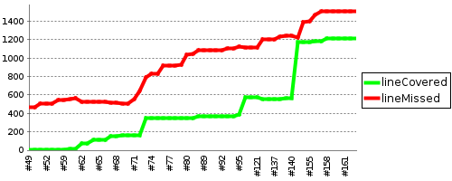

https://wiki.jenkins-ci.org/display/JENKINS/JaCoCo+Plugin

JUnit Plugin
------------

Visualizes how many of the test cases are failing or succeeding. 

http://wiki.jenkins-ci.org/display/JENKINS/JUnit+Plugin

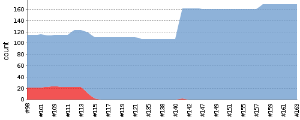

Configuration
~~~~~~~~~~~~~

We create a new item.

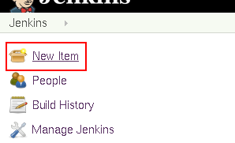

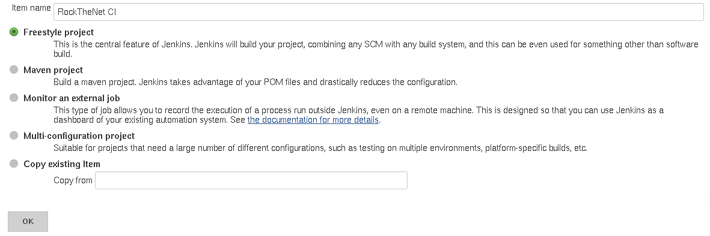

We want to build every time a commit is pushed to the central git repo at 
github. Github supports this with webhooks.

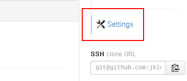

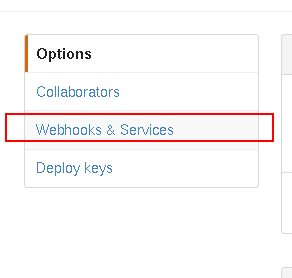

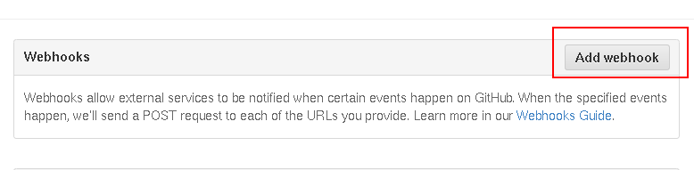

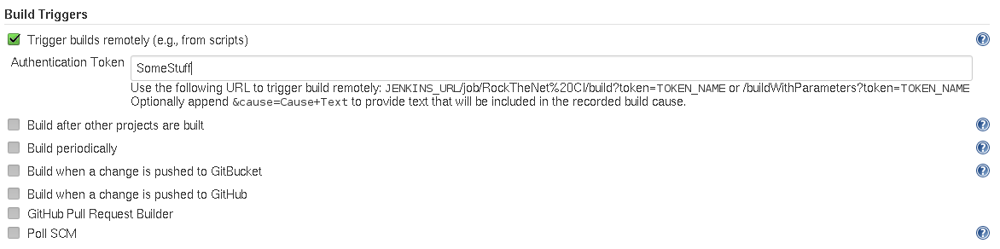

After the build we want to publish the artifacts.

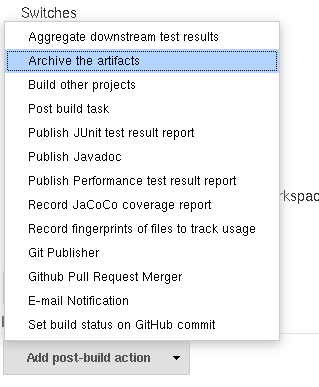

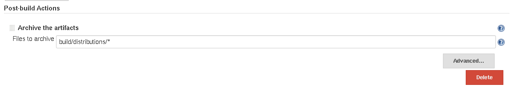

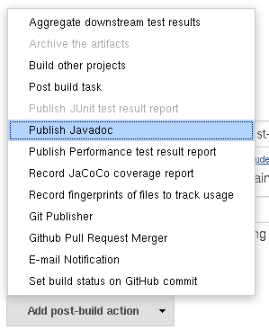

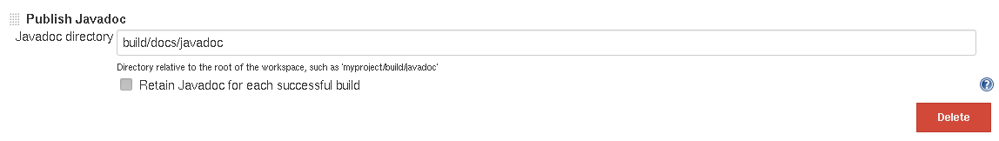

embeddable-build-status
-----------------------

The URL to the badge is:

https://ci.truh.in/buildStatus/icon?job=RockTheNet CI
    
GIT plugin
----------

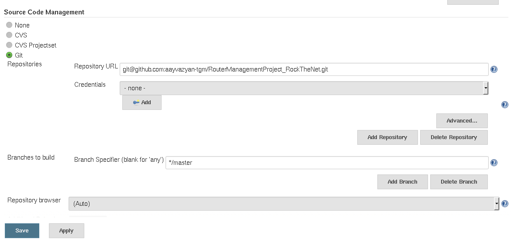

Gradle plugin
-------------

We want the gradle plugin to invoke our gradle build file.

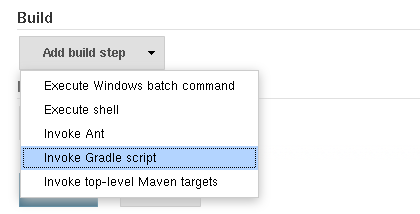

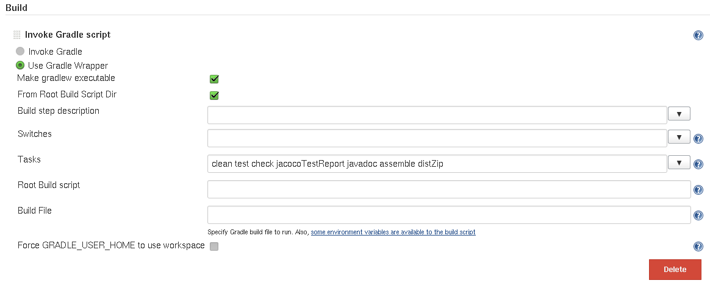

JUnit Plugin
------------

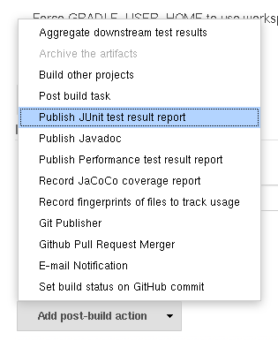

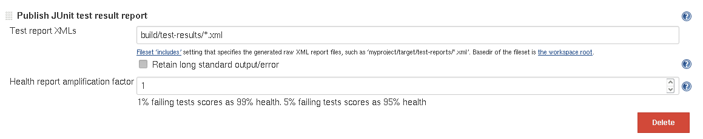

JaCoCo plugin
-------------

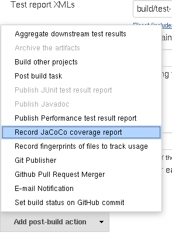

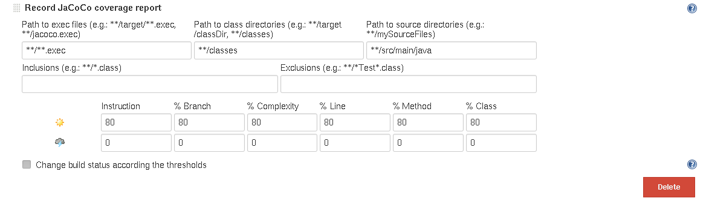

.. header::

    +-------------+--------------------+------------+
    | ###Title### | Andreas Vogt,      | 2014-11-06 |
    |             | Jakob Klepp        |            |
    +-------------+--------------------+------------+

.. footer::

    ###Page### / ###Total###
